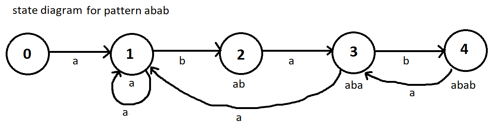
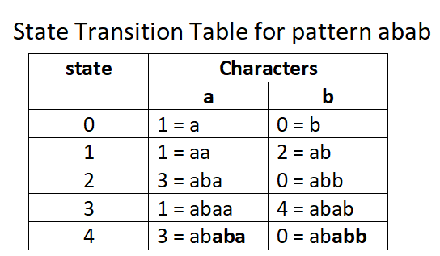

* PRESENTATION: file:///C:/Users/Nandita/Desktop/DSaA-W13.pdf 
* LAB TASK: file:///C:/Users/Nandita/Desktop/DSaA-Lab-12.pdf

**Test for Lab12**
automaton 1 1
ababac
ababac
kmp 2 3
aba
bac
ggggab
ab
acaaaaaaaaa
automaton 1 3
abab
abababababadsdsdsdsdsdsdsdsaba
fffjjjabababababababab
cccccccc
kmp 1 1
abcdef
abcdeabcder
ha

**useful material**
* http://www2.hawaii.edu/~suthers/courses/ics311f20/Notes/Topic-23.html,
* https://www.javatpoint.com/daa-knuth-morris-pratt-algorithm
* https://chortle.ccsu.edu/finiteautomata/index.html

/**
* Finite automaton M = {Q (set of states), q0 (start state), A(accepting states), Σ(input alphabet), δ(transition function)}
* Preprocessing: creating transition table (alphabets from pattern) (states = length of pattern + 1)
* finding states of transition table
* see if the text fed matches the pattern using the transition table
* helpful links: https://www.youtube.com/watch?v=OJmM61Jnf1I, https://www.youtube.com/watch?v=nNb9lu5Hvio
* valid shift = string match start position-1
  **/

/**
* helpful links: https://www.youtube.com/watch?v=GTJr8OvyEVQ
* Prefix Function: 5min 39sec to 10min 18sec - checks if prefix is same as suffix using indices of array
* KMP Matcher: 10min 23sec compare the text with pattern prefix function built
  **/

